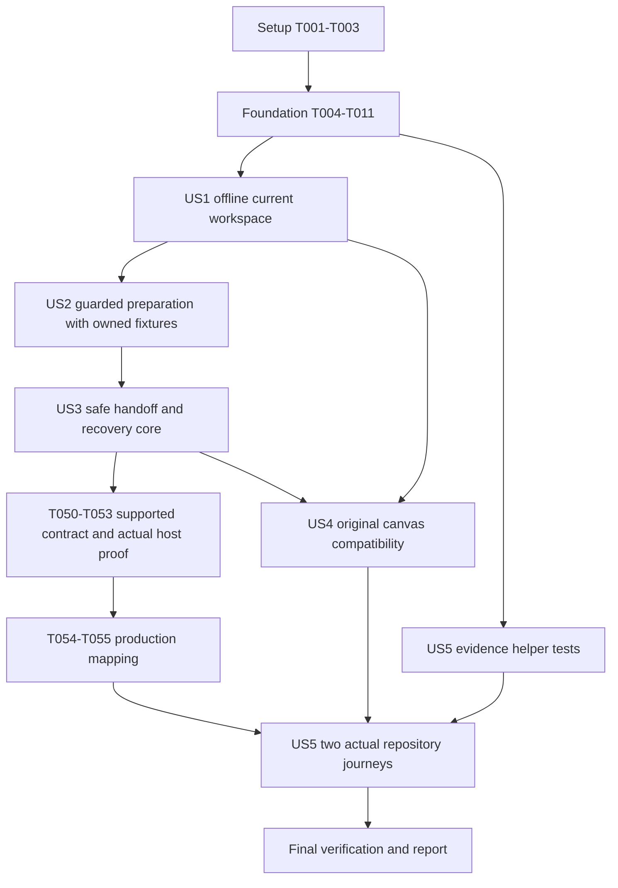

# Tasks: Repository Entry Layer

**Input**: Design documents in `specs/002-repository-entry-flow/`.

**Prerequisites**: [plan.md](plan.md), [spec.md](spec.md),
[research.md](research.md), [data-model.md](data-model.md),
[entry-layer.md](contracts/entry-layer.md),
[host-handoff.md](contracts/host-handoff.md), and [quickstart.md](quickstart.md).

**Tests**: Required by FR-022 and the plan. Add the story's tests before its
behavior changes, demonstrate the intended failure, and run the focused check
after every substantive edit. Keep the original canvas regression assertions;
replace only expectations belonging to the retired rail/manual-open experience.

**Organization**: Five user-story phases in specification order: US1-US4 are P1;
US5 is P2. Setup, foundation, and polish have no story labels. All tasks begin
unchecked; task generation does not establish implementation or acceptance.

**2026-09-21 scope amendment**: The user explicitly authorized standalone cloning
without automatic workspace switching. T080-T086 track that delivery separately.
The original automatic-handoff tasks and their actual-host proof remain blocked;
those gates no longer disable independently checked clone-only preparation.

## Format And Execution Rules

- Every task has a sequential ID and exact repository-relative file paths.
  Proposed implementation/test files are named explicitly; reuse an existing
  suitable file before adding another helper or test suite.
- `[P]` means the task can run with the other tasks in its named parallel wave
  after that wave's prerequisites complete. It does not permit concurrent edits
  to the same file in another story. Unmarked tasks execute sequentially within
  their phase unless a dependency below says otherwise.
- The plan's G-HOST is currently **ERROR: blocked**. Task T003 records the current
  capability decision; completing that inventory is not passing G-HOST. T050
  requires a supplied, supported host contract, and T053 requires actual-host
  proof in owned non-private fixtures. Keep either unchecked while blocked.
- T008 originally left production remote mutation unsupported. T023-T049 were developed
  against explicitly injected owned test adapters; synthetic success does not
  establish host support. T051-T053 are a bounded proof path, not production
   automatic-handoff enablement. T054 and full handoff acceptance require T053 PASS.
   T080-T086 independently enable/test clone-only preparation under the amendment.
- No standalone SDK/CLI client, guessed RPC, private App IPC, native UI automation,
  manual folder navigation, or display-only root change may replace the host
  contract. Do not clone a live private repository to investigate that contract.
- Offline/local entry and ownership work can proceed with G-HOST blocked. A
   standalone clone delivery must be reported separately; US3 and the full
   automatic flow cannot be marked delivered merely because a checkout succeeds.
- Use the existing Node/TypeScript, MSAL, native Git, build, and test packages.
  Keep configuration, tokens, account/session details, and private captures out
  of Git. Do not initialize projects, run workflows, alter grants/global plugins,
  commit, push, bump versions, or publish without separate authorization.
- After changing bundled sources, run the existing build and source-aware package
  verifier before actual-shell tests. A task is not complete with newly failing
  checks; retain specific blocked/not-run outcomes in the acceptance report.
- Foundation prepares the new coordinator without changing normal launch or
   retiring the existing UI's routes. T015 and T019-T022 form one coordinated
   migration changeset: replace the old UI expectations, switch renderer/routing,
   reject legacy endpoints, rebuild assets, and pass replacement/baseline checks
   together. Do not expose or release a halfway migration. Automatic handoff
   remains fail-closed while its stories and G-HOST are incomplete.

## Phase 1: Setup (Shared Infrastructure)

**Purpose**: Establish the current canvas baseline and the host decision before
changing behavior. Do not scaffold a new application or replace existing tooling.

- [X] T001 Record the current branch, relevant user changes, original SDD behavior/test baseline, payload hashes, and pending gate statuses in `specs/002-repository-entry-flow/evidence/acceptance.md`; preserve later canvas/reader fixes and put detailed private inventories only under Git-ignored `dist/repository-entry/`.
- [X] T002 [P] Verify the existing Node 24-compatible locked toolchain in `plugins/spec-kit-copilot-sdd/extensions/sdd-canvas/repository-browser/package.json` and `plugins/spec-kit-copilot-wizard/extensions/speckit-wizard-canvas/ui/markdown-reader/package.json`; install missing locked dependencies only with lifecycle scripts disabled using the validation guide, without adding a framework, SDK, or CLI.
- [X] T003 [P] Reconfirm the installed/public host capability mapping in `specs/002-repository-entry-flow/contracts/host-handoff.md`, recording exact supported facilities or the missing host-owner guarantees for atomic admission, visible activation, target acknowledgment, and reconciliation; leave G-HOST in ERROR when evidence is absent.

**Checkpoint**: Baseline is recorded; locked tooling is usable; the host gap is
explicit. An ERROR outcome in T003 is compatible with safe local-only work, not
with enabling real cloning.

## Phase 2: Foundational (Blocking Prerequisites)

**Purpose**: Build the shared contracts, fail-closed adapter, secure entry
boundary, and owned fixtures. Complete this phase before any story implementation.

- [X] T004 Define the shared `EntrySettings`, host snapshot/capabilities, selection, confirmation, preparation, handoff-attempt, and entry-state types in `plugins/spec-kit-copilot-sdd/extensions/sdd-canvas/repository-browser/src/types.ts`; separate server-owned identity/paths from opaque browser IDs according to the data model.
- [X] T005 Add the contract's bounded error categories and HTTP mappings, including `entry_required`, busy/unknown/stale context, unsupported host, changed source/clone identity, and uncertain handoff, in `plugins/spec-kit-copilot-sdd/extensions/sdd-canvas/repository-browser/src/errors.ts`; never include raw provider/Git exceptions or credentials.
- [X] T006 [P] Add entry-boundary contract tests in `plugins/spec-kit-copilot-sdd/extensions/sdd-canvas/repository-browser/test/repository-service.test.ts` for exact method/schema validation, duplicate inputs, 32 KiB bodies, rejected caller paths/host acknowledgments, safe state, and rejection of legacy-operation aliases by the isolated new coordinator; retain the current launch/router baseline until the coordinated US1 migration.
- [X] T007 [P] Add host-adapter contract tests in `plugins/spec-kit-copilot-sdd/extensions/sdd-canvas/repository-browser/test/host-handoff.test.ts` for partial/missing capabilities, unknown activity, 5-second read deadlines, stale observations, and unsupported mutation despite available cwd/activity APIs; use owned stubs, not live host calls.
- [X] T008 Implement the injectable adapter contract and default fail-closed production adapter in `plugins/spec-kit-copilot-sdd/extensions/sdd-canvas/repository-browser/src/host-handoff.ts`; support documented current-session inspection/local canvas opening, expose unknown state honestly, and reject remote admission/handoff/reconciliation until a verified integration exists.
- [X] T009 Extend `scripts/canvas-reader/fixtures/repositories.mjs` and `scripts/canvas-reader/serve-fixture.mjs` with isolated source/target workspaces, explicit test-only host adapters, controllable activity/context epochs and outcomes, and counters for Git starts, remote artifact reads, dispatches, and writes; retain safe defaults and owned cleanup.
- [X] T010 Add the coordinator's protected `/api/entry/state` boundary and strict request dispatch in `plugins/spec-kit-copilot-sdd/extensions/sdd-canvas/repository-browser/src/repository-service.ts` with an inactive routing integration in `plugins/spec-kit-copilot-sdd/extensions/sdd-canvas/extension.mjs`; reuse exact Host/Origin/capability guards, expose the new surface only to owned fixtures, and defer normal-launch changes and legacy endpoint retirement to T020 without altering the existing UI/router or local artifact-review baseline.
- [X] T011 Run the foundation unit/type/lint checks from `plugins/spec-kit-copilot-sdd/extensions/sdd-canvas/repository-browser/package.json` and verify `scripts/canvas-reader/serve-fixture.mjs` cannot select a real host/auth/Git adapter by default; record failures or the foundation checkpoint in `specs/002-repository-entry-flow/evidence/acceptance.md`.

**Checkpoint**: Shared types/security/test infrastructure are ready. The new
entry surface is not yet active at normal launch and its remote adapter fails
closed. The existing renderer/router baseline remains paired until US1's
coordinated migration; no host gate has been waived.

## Phase 3: User Story 1 - Continue With The Current Workspace (Priority: P1)

**Goal**: Chooser-first launch with one-action access to the original canvas in
the actual current workspace, without remote profile, sign-in, or cloning.

**Independent Test**: Use a dirty Spec Kit-enabled owned workspace with network
disabled and no remote profile; choose **Use current workspace**, read its local
spec in the original canvas, and assert identical files/branch plus zero sign-in,
clone, or workflow dispatch. A non-Git workspace has no actionable shortcut.

### Tests For User Story 1

- [X] T012 [P] [US1] Add current-workspace identity tests in `plugins/spec-kit-copilot-sdd/extensions/sdd-canvas/repository-browser/test/workspace-binding.test.ts` for ordinary dirty repositories, legitimate worktrees, canonical roots/common directories/origins, no repository, unavailable paths, and rejecting name-only or stale-context identity.
- [X] T013 [P] [US1] Add independent entry-settings tests in `plugins/spec-kit-copilot-sdd/extensions/sdd-canvas/repository-browser/test/profile.test.ts` for enabled-by-default settings, explicit disablement, malformed settings falling back to direct entry, and missing/invalid remote configuration not blocking local entry.
- [X] T014 [P] [US1] Add `/api/entry/state` and `/api/entry/local` tests in `plugins/spec-kit-copilot-sdd/extensions/sdd-canvas/repository-browser/test/repository-service.test.ts` for refreshed host/Git identity, request IDs, context changes, same-session canvas acknowledgment, and read-only continuation while busy without any remote request.
- [X] T015 [P] [US1] Define the coordinated migration tests in `scripts/canvas-reader/test/repositories.spec.mjs` and `scripts/canvas-reader/test/repository-browser.test.mjs`: replace only obsolete rail/remote-preview/manual-open expectations with chooser/local/direct and blocked-remote assertions; cover no profile/network, dirty-file preservation, no-Git state, entry-disabled/failing states, one continuation, retired-endpoint rejection after switching, and zero implicit dispatch while preserving all original canvas baseline tests.

### Implementation For User Story 1

- [X] T016 [US1] Add a separate validated user-local `entry-settings.json` loader in `plugins/spec-kit-copilot-sdd/extensions/sdd-canvas/repository-browser/src/profile.ts`; keep the existing strict remote-profile schema unchanged, default the delivered entry layer on, and fail malformed entry settings to direct entry without automatic writes.
- [X] T017 [US1] Expose bounded read-only current-repository inspection in `plugins/spec-kit-copilot-sdd/extensions/sdd-canvas/repository-browser/src/workspace-binding.ts`, deriving root/common directory/origin/HEAD/branch from the host cwd within 10 seconds; accept ordinary dirty workspaces without requiring a preparation record or changing Git state.
- [X] T018 [US1] Implement current-workspace state and the local-continuation route in `plugins/spec-kit-copilot-sdd/extensions/sdd-canvas/repository-browser/src/repository-service.ts`; re-read host/Git identity at the action, validate opaque local context, and open the original canvas in that session independently of remote configuration, account, and mutation capabilities.
- [X] T019 [US1] Create the separate chooser shell in `plugins/spec-kit-copilot-sdd/extensions/sdd-canvas/entry.html` with `plugins/spec-kit-copilot-sdd/extensions/sdd-canvas/repository-browser/src/ui/repository-entry.ts` and `plugins/spec-kit-copilot-sdd/extensions/sdd-canvas/repository-browser/src/ui/repository-entry.css`; implement local/no-repository/direct-fallback states and an isolated search area using existing fonts/icons without mounting or reparenting workflow DOM.
- [X] T020 [US1] As one coordinated migration with T015 and T019-T022, register normal chooser-first `sdd-canvas` and unconditional `sdd-canvas-direct` in `plugins/spec-kit-copilot-sdd/extensions/sdd-canvas/extension.mjs`, remove the old mount from `plugins/spec-kit-copilot-sdd/extensions/sdd-canvas/index.html`, and reject `/api/repositories/clone*` plus retired context/items/content/reference/refresh entry operations at the router and `plugins/spec-kit-copilot-sdd/extensions/sdd-canvas/repository-browser/src/repository-service.ts`; reuse original workflow handlers/local review, enforce `entry_required`, and do not enable incomplete remote behavior.
- [X] T021 [US1] Wire the named entry renderer/assets into `plugins/spec-kit-copilot-sdd/extensions/sdd-canvas/repository-browser/build-runtime.mjs` and `scripts/canvas-reader/stage-app-fixture.mjs`, regenerate `plugins/spec-kit-copilot-sdd/extensions/sdd-canvas/ui/repository-entry.js` and `plugins/spec-kit-copilot-sdd/extensions/sdd-canvas/ui/repository-entry.css`, and verify their manifest before running shell tests; do not edit generated bundles manually.
- [X] T022 [US1] Complete the migration changeset only after T012-T021 checks, migrated controller/browser tests, rebuilt asset verification, legacy-route rejection, and original direct-canvas smoke checks from `specs/002-repository-entry-flow/quickstart.md` pass together; record offline local entry with G-HOST blocked, source preservation, zero implicit actions, and the partial-MVP result in `specs/002-repository-entry-flow/evidence/acceptance.md`.

**Checkpoint**: US1 is independently usable. This is the suggested MVP, not a
claim that remote preparation/handoff is complete.

## Phase 4: User Story 2 - Select, Confirm, And Clone A Repository (Priority: P1)

**Goal**: Dropdown-only team suggestions/project search, metadata selection,
explicit single-use consent, and bounded preparation at the displayed destination.

**Independent Test**: In the actual shell with owned provider/Git/host fixtures,
search/type/clear, select a different repository, cancel confirmation, then confirm
once on a supported-idle test host. Expect zero pre-consent writes/content reads,
one owned clone after confirmation, and rejection on unsupported/busy/stale hosts.
Passing fixtures is not permission to enable cloning against real repositories.

### Tests For User Story 2

- [X] T023 [P] [US2] Extend `plugins/spec-kit-copilot-sdd/extensions/sdd-canvas/repository-browser/test/discovery.test.ts` for independent team/project collections, empty and failed suggestions, account-bound pagination, current-ref/access revalidation, and no whole-project fallback or user-facing pre-clone artifact reads.
- [X] T024 [P] [US2] Extend `plugins/spec-kit-copilot-sdd/extensions/sdd-canvas/repository-browser/test/clone.test.ts` for full consent binding/120-second expiry, ref/account/context/capability changes, atomic idle-admission races, duplicate request IDs, no pre-consent directories, cancellation, occupied destinations, and the existing Git environment/10-minute deadline safeguards.
- [X] T025 [P] [US2] Add preparation-store tests in `plugins/spec-kit-copilot-sdd/extensions/sdd-canvas/repository-browser/test/preparation-store.test.ts` for version-2 8 KiB records, at most 256 inspections, atomic completion writes, immutable source/account fields, secret exclusion, redirected paths, and read-only version-1 4 KiB inputs with missing authorization remaining non-actionable.
- [X] T026 [P] [US2] Add selection/clone/progress/cancel HTTP tests in `plugins/spec-kit-copilot-sdd/extensions/sdd-canvas/repository-browser/test/repository-service.test.ts` for unsupported/unknown/busy rejection, guarded source/destination binding, unauthorized-operation concealment, idempotent accepted responses, current-repository shortcut, and no legacy endpoint bypass.
- [X] T027 [P] [US2] Extend the entry-only controller tests introduced by T015 in `scripts/canvas-reader/test/repository-browser.test.mjs` with suggestion/search/clear, keyboard/focus, stale-response cancellation, independent local route, and consent/progress states; preserve local/direct coverage and assert no artifact tree, remote reader, or workflow DOM reparenting.
- [X] T028 [P] [US2] Extend the migrated entry journeys from T015 in `scripts/canvas-reader/test/repositories.spec.mjs` with selection/cancel/confirm/progress/cancel-operation cases at 360/768/1280/1920 px, verifying the displayed account/ref/commit/destination and zero clone/content/workflow activity before confirmation; keep US1 and legacy-route rejection assertions intact.

### Implementation For User Story 2

- [X] T029 [US2] Reuse bounded delegated discovery and add the selection-time/start-time metadata revalidation needed in `plugins/spec-kit-copilot-sdd/extensions/sdd-canvas/repository-browser/src/discovery.ts`; preserve signed cursors, project/access boundaries, four-way detail concurrency, and existing manifest-only personalization without fetching spec content.
- [X] T030 [US2] Implement account/profile/source-session-bound selection and 120-second consent previews in `plugins/spec-kit-copilot-sdd/extensions/sdd-canvas/repository-browser/src/repository-service.ts`; calculate the canonical default destination without creating it, detect the actual current repository/worktree, and require fresh confirmation when the default ref or any binding changes.
- [X] T031 [US2] Implement the bounded credential-free store in `plugins/spec-kit-copilot-sdd/extensions/sdd-canvas/repository-browser/src/preparation-store.ts`; validate ownership/canonical regular paths and record schemas, write completion atomically outside checkouts, retain completed records, and never migrate unverifiable legacy identity or delete records on overflow.
- [X] T032 [US2] Decouple `plugins/spec-kit-copilot-sdd/extensions/sdd-canvas/repository-browser/src/clone.ts` from `RemoteReview` by accepting a server-validated repository/ref/commit preparation source; preserve the managed per-operation destination, shell-free trusted Git, isolated credential environment, no overwrite/hooks/submodules, and owned-process cleanup.
- [X] T033 [US2] Enforce single-use consent, current-source/context revalidation, and exactly-one start through injected host-atomic `admitPreparation` semantics in `plugins/spec-kit-copilot-sdd/extensions/sdd-canvas/repository-browser/src/clone.ts`; maintain one active clone/32 operations, persist verified completion through the store, and keep the production adapter unsupported until T054.
- [X] T034 [US2] Implement `/api/entry/selection`, `/api/entry/clone`, operation status/cancel, and retained-preparation lookup in `plugins/spec-kit-copilot-sdd/extensions/sdd-canvas/repository-browser/src/repository-service.ts`; apply exact schemas, guarded IDs, safe errors, idempotency, and progress-only SSE with no automatic command submission.
- [X] T035 [US2] Implement explicit connection and dropdown-only suggestion/search/clear flows in `plugins/spec-kit-copilot-sdd/extensions/sdd-canvas/repository-browser/src/ui/repository-entry.ts` and its existing API helper `plugins/spec-kit-copilot-sdd/extensions/sdd-canvas/repository-browser/src/ui/api.ts`; keep the 1-second debounce, separate collections/cancellation, accessible keyboard selection, and local continuation during remote failures.
- [X] T036 [US2] Add visible consent, default destination, bounded failure/progress, duplicate-submit prevention, and explicit cancel controls in `plugins/spec-kit-copilot-sdd/extensions/sdd-canvas/repository-browser/src/ui/repository-entry.ts` and `plugins/spec-kit-copilot-sdd/extensions/sdd-canvas/repository-browser/src/ui/repository-entry.css`; busy/unknown/unsupported state disables mutation without queued intent or resume-on-idle.
- [X] T037 [US2] Separate transient invalidation from durable completion in `plugins/spec-kit-copilot-sdd/extensions/sdd-canvas/repository-browser/src/repository-service.ts` and `plugins/spec-kit-copilot-sdd/extensions/sdd-canvas/repository-browser/src/clone.ts`; close/disconnect cancels only owned incomplete work, preserves completed clones/records, and never auto-resumes on reopen or reconnection.
- [X] T038 [US2] Rebuild the entry payload and run T023-T028 through `specs/002-repository-entry-flow/quickstart.md`; verify cancellation/no-preconsent writes, one mocked admitted clone, source preservation, and backend fail-closed behavior, recording synthetic-only scope in `specs/002-repository-entry-flow/evidence/acceptance.md`.

**Checkpoint**: The flow is testable with owned fixtures; actual production clone
enablement remains blocked pending T053-T054. Do not count this checkpoint as
native US2 delivery.

## Phase 5: User Story 3 - Enter The Canvas In The Selected Session Repository (Priority: P1)

**Goal**: Bind the visible App session and original canvas to the prepared
repository, with preserved source work, explicit recovery, and no duplicate clone.

**Independent Test**: Inject a completed owned preparation and a contract-compliant
test host; verify target-side acknowledgment, stale-source action rejection,
retained-clone retry, busy/race rejection, and reconciliation of uncertain results.
For actual acceptance, use the supported host mapping and prove visible session,
host cwd, Git identity, and original canvas agree without manual navigation.

### Tests For User Story 3

- [X] T039 [P] [US3] Extend `plugins/spec-kit-copilot-sdd/extensions/sdd-canvas/repository-browser/test/host-handoff.test.ts` with atomic preparation/handoff race ordering, partial-capability rejection, `workspace_activated` before guarded canvas open, target verification before `canvas_ready`, blocked workflows between phases, context changes, busy activity including commands/background work, and idempotent uncertain-outcome lookup; never treat cwd mutation plus an idle read as conformance.
- [X] T040 [P] [US3] Add coordinator transition/retry tests in `plugins/spec-kit-copilot-sdd/extensions/sdd-canvas/repository-browser/test/repository-service.test.ts` for uninterrupted confirmed progression, busy-then-idle invalidation, persisted attempt/activation-before-open ordering, the 30-second final-readiness deadline, activation followed by missing provider or failed verification, same-attempt canvas-only recovery without another switch, changed access, one unresolved attempt, and zero clone calls on handoff retry.
- [X] T041 [P] [US3] Extend `plugins/spec-kit-copilot-sdd/extensions/sdd-canvas/repository-browser/test/workspace-binding.test.ts` with separate original-clone and target rules: preserve original branch/commit/files, accept a registered host-attested linked worktree on a different named branch at the same prepared commit, reject unattested branch/detached/prewarm/missing-registration/wrong-origin/common-directory/changed-HEAD/content/stale-activation cases, and allow normal local changes only after verified `canvas_ready` without reset.
- [X] T042 [P] [US3] Extend `plugins/spec-kit-copilot-sdd/extensions/sdd-canvas/repository-browser/test/preparation-store.test.ts` with interrupted/late handoff persistence, account/profile-mismatched recovery, old-record inspection, reconnect/close retention, and no automatic restart or deletion after process replacement.
- [X] T043 [P] [US3] Add actual-shell recovery/target-binding tests in `scripts/canvas-reader/test/repositories.spec.mjs` for failed/in-progress/unknown/late outcomes, explicit handoff-only retry, `workspace_activated` without a ready provider, guarded direct-provider bypass rejection, entry controls leaving only at `canvas_ready`, and source/target workspace isolation using owned test hosts.

### Implementation For User Story 3

- [X] T044 [US3] Implement durable handoff attempts and bounded retained-completion recovery in `plugins/spec-kit-copilot-sdd/extensions/sdd-canvas/repository-browser/src/preparation-store.ts`; persist attempt IDs before submission and distinguish `workspace_activated` from `canvas_ready`, retain immutable source identity and the last confirmed phase, and allow only one unresolved attempt without persisting capabilities, consent, or auth secrets.
- [X] T045 [US3] Extract pre-handoff and target-side Git verification in `plugins/spec-kit-copilot-sdd/extensions/sdd-canvas/repository-browser/src/workspace-binding.ts`; keep the managed original checkout's recorded branch/commit/files immutable before readiness, validate `prepared_checkout` by exact identity, and validate `host_worktree` by attempt-bound host cwd/branch attestation, Git registration, common directory/origin, exact prepared commit and clean files/index rather than prepared-branch equality; preserve mismatches and switch to ordinary local rules only after `canvas_ready`.
- [X] T046 [US3] Implement the preparation-to-handoff state machine in `plugins/spec-kit-copilot-sdd/extensions/sdd-canvas/repository-browser/src/repository-service.ts`; persist completion first, request host transition only within uninterrupted admitted consent, record `workspace_activated` before guarded target-canvas opening, invalidate automatic eligibility on any busy/context/failure event, and hold workflow actions until verified `canvas_ready`.
- [X] T047 [US3] Implement explicit `/api/entry/operations/{id}/handoff` recovery in `plugins/spec-kit-copilot-sdd/extensions/sdd-canvas/repository-browser/src/repository-service.ts`; revalidate same-account access, retained clone and current context, reconcile the prior attempt first, reuse verified `canvas_ready`, resume only guarded opening/verification for a confirmed `workspace_activated` attempt, keep unknown/in-progress blocked, and never switch twice or clone on retry.
- [X] T048 [US3] Bind every workflow instance and action to host-derived session/context/Git identity in `plugins/spec-kit-copilot-sdd/extensions/sdd-canvas/extension.mjs`; after `workspace_activated`, open the allowlisted original target provider in a guarded state, verify its own host/Git identity, record `canvas_ready`, and only then enable workflows; reject direct-provider bypass for a pending handoff, dispose stale instance services safely across reloads, and never retarget a process-global project root or `session.send` from browser selection.
- [X] T049 [US3] Implement retained-clone, waiting-for-user, validation-blocked, handoff-failed, and outcome-unknown views in `plugins/spec-kit-copilot-sdd/extensions/sdd-canvas/repository-browser/src/ui/repository-entry.ts`; explicit Retry handoff reconciles first, while idle/auth/SSE events only refresh controls and never navigate or submit commands.
- [ ] T050 [US3] Obtain and document a supported host-owner mapping for every required adapter guarantee in `specs/002-repository-entry-flow/contracts/host-handoff.md`, including authoritative activity and context ordering, visible activation, provider lifecycle, target acknowledgment, and outcome lookup; keep this task unchecked and G-HOST in ERROR if the integration is unavailable.
- [ ] T051 [US3] After T050, implement the supplied versioned host facilities in `plugins/spec-kit-copilot-sdd/extensions/sdd-canvas/repository-browser/src/host-handoff.ts` behind capability negotiation and an owned-proof-only activation boundary; preserve the default unsupported production behavior until T053 passes, with no guessed SDK methods, extra client, manual navigation, or native-click implementation.
- [ ] T052 [US3] Extend `plugins/spec-kit-copilot-sdd/extensions/sdd-canvas/repository-browser/stage-native.mjs` to build and stage the new entry/direct providers and supplied adapter only in owned non-private proof fixtures, verifying exact runtime hashes and excluding test adapters from normal payloads; never install into unrelated repositories or global App configuration.
- [ ] T053 [US3] Run every actual-host proof scenario in `specs/002-repository-entry-flow/contracts/host-handoff.md` through the owned staging tool and record sanitized versions/capabilities/results in `specs/002-repository-entry-flow/evidence/acceptance.md`; mark G-HOST PASS only after atomic races, ordered activation/readiness, positive and negative linked-worktree branch mapping, source preservation, reload behavior, and late-result reconciliation are proved, otherwise leave this task blocked.
- [ ] T054 [US3] Only after T053 PASS, enable the verified capability-negotiated automatic-handoff mapping in `plugins/spec-kit-copilot-sdd/extensions/sdd-canvas/repository-browser/src/host-handoff.ts` and its eligibility checks in `plugins/spec-kit-copilot-sdd/extensions/sdd-canvas/repository-browser/src/repository-service.ts`; unsupported/partial/mismatched hosts must reject handoff while preserving the separately authorized checked clone-only path.
- [ ] T055 [US3] Rebuild and run the handoff/state/binding suites from `specs/002-repository-entry-flow/quickstart.md`, verify clone counts remain unchanged on retries and zero stale-source dispatches occur, and record the real-versus-synthetic boundary and G-HOST result in `specs/002-repository-entry-flow/evidence/acceptance.md`.

**Checkpoint**: US3 completes only with supported actual-host proof. If T050 or
T053 is blocked, keep T051-T055 as applicable unchecked; safe mock-tested work and
US4 may continue, but no live private clone or whole-feature completion follows.

Implementation checkpoint: T039-T049 passed the owned automated core matrix.
T050-T055 remain blocked because no supported host-owner mapping has been supplied;
the production adapter still advertises no remote mutation capabilities. Continue
only with the explicitly permitted safe US4/evidence/documentation tasks.

The supplemental [native command probe](evidence/acceptance.md#supplemental-native-host-command-probe)
also remains a failing host proof: runtime `cwd` invocation changed only the
runtime target while the App folder opener retained the source; host command
dispatch returned `No client found for command: cwd`. The test session was
restored. No blocked task is checked off and no private clone was started.

## Phase 6: User Story 4 - Keep Canvas Ownership And Behavior Separate (Priority: P1)

**Goal**: Preserve the original canvas's structure, navigation, prerequisites,
setup, and workflow commands behind a minimal independently failing entry layer.

**Independent Test**: Compare direct entry and current-workspace entry with the
captured original baseline; use a verified-target fixture for the clone result.
Disable or fault the entry service and confirm direct canvas remains available,
without entry DOM/CSS/network dependency or implicit setup/dispatch.

### Tests For User Story 4

- [X] T056 [P] [US4] Extend equivalence checks in `scripts/canvas-reader/test/sdd-shell.spec.mjs` for original/direct/local/verified-target canvas controls, artifact navigation, prerequisites and commands; preserve baseline assertions and assert no repository-layer DOM, CSS reparenting, or remote auth dependency downstream.
- [X] T057 [P] [US4] Extend `scripts/canvas-reader/test/repository-staging.test.mjs` and `scripts/canvas-reader/test/package-security.test.mjs` to validate exact new asset inventory/hashes/notices and reject obsolete entry assets, bundled SDKs, source/test adapters, profiles, private evidence, credential data, and redirected paths.
- [X] T058 [P] [US4] Add entry-failure/disabled/unconfigured/missing-provider isolation checks in `scripts/canvas-reader/test/repository-browser.test.mjs`; direct entry remains discoverable, a non-Spec Kit workspace uses only the canvas's existing explicit setup behavior, and no launch action implicitly initializes or dispatches work.

### Implementation For User Story 4

- [X] T059 [US4] Finalize lazy entry-service startup and failure-isolated normal/direct launch routing in `plugins/spec-kit-copilot-sdd/extensions/sdd-canvas/extension.mjs`; ensure neither a broken remote profile nor entry-controller failure disables original direct handlers, and preserve the canvas team's scanner, prerequisites, artifact navigation, and explicit command semantics.
- [X] T060 [US4] After T022 and replacement coverage pass, remove only remaining unreachable embedded imports/source and obsolete generated assets in `plugins/spec-kit-copilot-sdd/extensions/sdd-canvas/index.html`, `plugins/spec-kit-copilot-sdd/extensions/sdd-canvas/repository-browser/src/ui/repository-browser.ts`, `plugins/spec-kit-copilot-sdd/extensions/sdd-canvas/ui/repository-browser.js`, and `plugins/spec-kit-copilot-sdd/extensions/sdd-canvas/ui/repository-browser.css`; routing retirement already occurred in T020, so this cleanup cannot change entry behavior or remove reusable security/auth/discovery/shared reader code.
- [X] T061 [US4] Finalize strict entry-payload staging and synthetic preview support in `scripts/canvas-reader/stage-app-fixture.mjs` and `scripts/canvas-reader/serve-repositories.mjs`; allow only the new named assets/providers, reject build/private files, and keep preview auth/Git/host behavior synthetic with no exposed capability in the launcher URL.
- [X] T062 [US4] Regenerate and verify the final named assets/server bundle using `plugins/spec-kit-copilot-sdd/extensions/sdd-canvas/repository-browser/build-runtime.mjs`, including `plugins/spec-kit-copilot-sdd/extensions/sdd-canvas/vendor/repository-browser/manifest.json`; preserve source-aware hashes, dependency closure/notices and cross-platform bytes, updating `plugins/spec-kit-copilot-sdd/extensions/sdd-canvas/README.md` only for packaging facts at this step.
- [X] T063 [US4] Update `.github/workflows/canvas-reader-validation.yml` to include the new feature path and entry tests while retaining locked installs, audits, Windows/Linux matrix, existing canvas regressions, source-aware package checks, and synthetic-only artifact uploads; do not bypass a gate or add private native evidence to CI artifacts.
- [X] T064 [US4] Run the complete existing canvas/reader/packaging compatibility section of `specs/002-repository-entry-flow/quickstart.md` and record G-COMPAT evidence in `specs/002-repository-entry-flow/evidence/acceptance.md`; do not weaken original workflow expectations or claim native handoff from verified-target fixtures.

**Checkpoint**: Canvas ownership and automated compatibility are preserved. US4's
safe verification can complete without production handoff; actual clone-route
equivalence still belongs to the gated native acceptance in US5.

## Phase 7: User Story 5 - Receive Verifiable Delivery Evidence (Priority: P2)

**Goal**: Deliver a truthful, reproducible report for two distinct real Spec
Kit-enabled repositories, keeping private evidence outside Git.

**Independent Test**: Validate report/evidence handling using synthetic records
first. Then, after G-HOST and compatibility gates pass, require an actual App
current-workspace journey and one confirmed clone/handoff journey with matching
host/Git/canvas identity, preservation checks, and clearly separated test scopes.

### Tests For User Story 5

- [X] T065 [P] [US5] Extend evidence safety checks in `plugins/spec-kit-copilot-sdd/extensions/sdd-canvas/repository-browser/test/native-proof.test.ts` to reject token/capability/consent leakage and prevent synthetic or manual-open results from satisfying new automatic-handoff acceptance; use only synthetic identities and document fixtures.
- [X] T066 [P] [US5] Add owned native-staging/preservation tests in `scripts/canvas-reader/test/repository-staging.test.mjs` for canonical fixture containment, exact payload fingerprints, tracked/untracked source inventories, completed-clone retention, and no silent setup/install or real workflow dispatch by acceptance tools.

### Implementation And Acceptance For User Story 5

- [X] T067 [US5] Extend bounded native acceptance helpers in `plugins/spec-kit-copilot-sdd/extensions/sdd-canvas/repository-browser/stage-clone-acceptance.mjs` and `plugins/spec-kit-copilot-sdd/extensions/sdd-canvas/repository-browser/src/native-proof.ts` to record exact payload/host/Git identity, consent and clone counts, source fingerprints, scoped outcomes and cleanup without invoking workflows or persisting credentials.
- [ ] T068 [US5] After T053, T055 and T064 pass, confirm the bounded two-repository test scope/account/destination and record actual App/SDK versions, negotiated capabilities, exact payload hashes, and source tracked/untracked/branch baselines in Git-ignored `dist/repository-entry/native-run.json`; ensure the original canvas is already available without installing or initializing it.
- [ ] T069 [US5] Perform the actual App current-workspace journey on repository A while remote auth is disconnected, read its existing spec and compare direct-canvas behavior, and record zero sign-in/clone/workflow actions plus unchanged source identity/files in `dist/repository-entry/current-workspace.json`.
- [ ] T070 [US5] Search and select approved repository B in the actual entry dropdown, inspect account/ref/commit/default destination, cancel confirmation once, and record zero new clone directories or preparation records in `dist/repository-entry/clone-consent.json` before any confirmed live preparation.
- [ ] T071 [US5] Confirm exactly one live clone of B while idle, record ordered `workspace_activated` and `canvas_ready` evidence plus the immutable prepared branch and separately host-attested target kind/cwd/branch, verify the applicable original/linked-worktree Git rule and automatic visible App activation, then open B's existing spec without a workflow run and save `dist/repository-entry/clone-handoff.json`; manual opening, branch-name matching alone, or browser-only rendering cannot pass this task.
- [ ] T072 [US5] Recheck busy/race/failure/late-result handling and explicit handoff-only retry on owned non-private App fixtures, retaining completed clones and proving no second clone or stale-source dispatch, and record accurately scoped results in `dist/repository-entry/handoff-recovery.json` without injecting failures into the user's live repositories.
- [ ] T073 [US5] Compare final source files/branch/untracked inventory and preparation counts against T068, disconnect only owned test auth, close only owned test surfaces, retain completed clones, and write the cleanup/preservation result to `dist/repository-entry/preservation.json`; do not reset or remove unrelated work.
- [ ] T074 [US5] Write the sanitized two-route report in `specs/002-repository-entry-flow/evidence/acceptance.md` mapping SC-001 through SC-008 to actual results, payload identity, clone counts, preservation and cleanup; distinguish synthetic/native/hosted-CI evidence and list every blocked or unrun case without copying private names, source, paths, screenshots, or credentials into Git.

**Checkpoint**: G-NATIVE passes only with the real App results and source
preservation above. Missing supported handoff keeps the full delivery blocked;
earlier implementation's manual clone proof is not reusable as this acceptance.

## Phase 8: Polish And Cross-Cutting Concerns

**Purpose**: Finish user documentation and final scoped verification without
expanding into a release, version bump, commit, or unrelated cleanup.

- [X] T075 [P] Update `docs/sdd-repository-browser.md` for chooser-first/direct entry, offline current-workspace use, dropdown suggestions, supported-host-only confirmation, busy blocking, retained-clone recovery, and no automatic setup; clearly distinguish the replaced embedded/manual-opening design.
- [X] T076 [P] Update `README.md` and `plugins/spec-kit-copilot-sdd/extensions/sdd-canvas/README.md` with the implemented entry points, exact supported-host limitations, setup boundaries, and validation guide; preserve independent plugin versioning and do not claim G-HOST or release status without evidence.
- [X] T077 Audit installable output with `scripts/canvas-reader/test/package-security.test.mjs` and `scripts/canvas-reader/test/repository-staging.test.mjs`, checking final source-aware hashes, named-asset/route inventory, absence of old bypasses, and exclusion of every private profile/capture/test adapter; record any issue rather than deleting evidence or changing unrelated settings.
- [X] T078 Run the final required checks in `specs/002-repository-entry-flow/quickstart.md`, including at least 20 owned local timing runs for the 2-second p95 goals and injected-clock deadline checks; reconcile configured Windows/Linux CI gates in `.github/workflows/canvas-reader-validation.yml`, recording unavailable/unauthorized hosted execution as not run rather than pushing or claiming it passed.
- [X] T079 Finalize the FR/SC and G-HOST/G-COMPAT/G-NATIVE verdicts in `specs/002-repository-entry-flow/evidence/acceptance.md` against the final payload and actual test output; leave blocked requirements and their tasks unchecked, and report only the demonstrated scope without a commit, push, version bump, or publication.

## Standalone Clone Amendment (2026-09-21)

- [X] T080 [US2] Separate checked clone admission from automatic handoff in `plugins/spec-kit-copilot-sdd/extensions/sdd-canvas/repository-browser/src/host-handoff.ts` and `src/types.ts`; keep atomic/handoff capabilities false and reject unknown, busy, stale and duplicate starts.
- [X] T081 [US2] Connect the isolated clone engine and coordinator in `plugins/spec-kit-copilot-sdd/extensions/sdd-canvas/repository-browser/src/clone.ts` and `src/repository-service.ts`; retain one completed checkout without creating a handoff attempt or changing the current workspace.
- [X] T082 [US2] Add completed/retained checkout paths and clipboard controls in `plugins/spec-kit-copilot-sdd/extensions/sdd-canvas/repository-browser/src/ui/repository-entry.ts`; state that the workspace stays unchanged and hide unsupported handoff controls.
- [X] T083 [US2] Verify production-adapter clone-only admission, activity-event invalidation, reconnect retention, idempotency and 360/768/1280/1920 px journeys in existing package tests and `scripts/canvas-reader/test/repositories.spec.mjs`, `repository-browser.test.mjs` and `fixture-tools.test.mjs`.
- [X] T084 Record the authorized standalone scope and non-atomic observation limit in `specs/002-repository-entry-flow/spec.md`, `plan.md`, `data-model.md`, both contracts, `quickstart.md`, `.github/instructions/repository-entry.instructions.md`, `docs/sdd-repository-browser.md`, and the root/SDD READMEs.
- [X] T085 Rebuild and verify the five-asset runtime with `plugins/spec-kit-copilot-sdd/extensions/sdd-canvas/repository-browser/build-runtime.mjs`; run existing canvas, shared-reader, package/security, browser and lint gates; preserve the reader payload and make `scripts/canvas-reader/serve-repositories.mjs` demonstrate clone-only behavior.
- [ ] T086 [US5] Verify one explicitly approved private repository through the actual App's clone-only canvas after owned checks pass; cancel once, clone once, verify the retained checkout and unchanged source/session, disconnect test auth, and record sanitized results in `specs/002-repository-entry-flow/evidence/acceptance.md` with private details only in ignored evidence.

## Dependencies And Execution Order

### Phase Dependencies

| Work | Prerequisites | Completion Boundary |
| --- | --- | --- |
| Setup T001-T003 | None; T002/T003 follow the baseline inventory | Toolchain plus explicit host decision, not G-HOST PASS. |
| Foundation T004-T011 | Setup complete | New coordinator inactive at normal launch; keep existing renderer/router paired. |
| US1 T012-T022 | Foundation | T015 plus T019-T022 migrate UI/routes/tests/assets together; validate at T022 before exposure/release. No supported remote host required. |
| US2 T023-T038 | US1 shared renderer/routing | Mock-tested discovery/consent/preparation; production clone stays disabled. |
| US3 safe core T039-T049 | US2 completion/store contracts | Isolated handoff/recovery tests and coordinator; no host support claim. |
| US3 host proof T050-T053 | T003 evidence, safe core, supplied public host contract | External blocker until actual supported host matrix passes. |
| US3 production mapping T054-T055 | T053 PASS | Negotiated production enablement, not a blanket version bypass. |
| US4 T056-T064 | US1 and safe US2/US3 integration | Can proceed when T050/T053 is blocked using clearly labeled target fixtures. |
| US5 tools T065-T067 | Foundation and implemented state/report contracts | Evidence helpers can be tested without private data or real clones. |
| US5 native T068-T074 | T053, T055, T064 and evidence helpers complete | Two actual App repository journeys; no fixture-only completion. |
| Polish T075-T079 | Implemented stories; safe docs/audits may proceed while gates remain blocked | Full completion requires all mandatory actual results, not checked boxes alone. |

### Within Each Story

1. Write the story's independent tests, preserving existing safeguards and showing
   that failures are caused by the missing behavior rather than a broken harness.
2. Implement shared-model additions before services, guarded routes before UI
   integration, and durable completion before any handoff request.
3. Run each touched slice's focused test immediately. Rebuild generated assets and
   verify their source-aware manifest before exercising an actual shell.
4. Validate the story's independent test and record the evidence scope before
   declaring the checkpoint. A simulated successful host is never G-HOST PASS.
5. Serialize tasks sharing `repository-service.ts`, `extension.mjs`, entry UI,
   manifests, browser tests, or acceptance reports across story phases.

### Parallel Waves

The following are the only marked parallel groups. Every group uses disjoint
edited files and has no dependency on an unfinished sibling in that group.

| Wave | Prerequisites | Tasks That May Run Together |
| --- | --- | --- |
| Setup tooling and host inventory | T001 | T002, T003 |
| Foundation contract tests | T004-T005 | T006, T007 |
| US1 tests | T011 | T012, T013, T014, T015 |
| US2 tests | T022 | T023, T024, T025, T026, T027, T028 |
| US3 tests | T038 | T039, T040, T041, T042, T043 |
| US4 tests | US1 and safe US2/US3 core | T056, T057, T058 |
| US5 evidence tests | Earlier changes to the same test files complete | T065, T066 |
| Final documentation | Implemented behavior/evidence is stable | T075, T076 |

## Parallel Examples Per User Story

### User Story 1

Run T012 current-workspace Git tests and T013 independent settings tests together;
T014 service-contract tests and T015 actual-shell tests may join that same wave.
Do not start T016-T021 until the test expectations are reviewed.

### User Story 2

Run T023 discovery tests, T024 clone/admission tests, and T025 durable-record tests
in parallel; T026-T028 occupy separate service/controller/browser test files.
Keep subsequent service, clone, and UI implementation tasks sequential.

### User Story 3

Run T039 host contract tests with T041 target identity tests and T042 retained
attempt tests. T040 and T043 may run alongside them in their separate test files.
This does not authorize native host calls or resolve T050/T053.

### User Story 4

Run T056 shell-equivalence tests with T057 payload-security/staging tests and
T058 controller-isolation tests once earlier edits to those files are complete.
Serialize the shared extension, generated assets, and final report updates.

### User Story 5

Run T065 redaction/scope tests and T066 owned-fixture/preservation tests together.
Run the actual App journeys sequentially; they share foreground session state,
consent, a single approved clone, and baseline inventories.

## Design-To-Task Traceability

| Design Element | Primary Tasks |
| --- | --- |
| EntrySettings and independent remote profile | T013, T016, T018, T020 |
| HostWorkspaceSnapshot and ordinary local repository identity | T007-T008, T012, T017-T018 |
| RepositorySelection and dropdown collections | T023, T029-T030, T035 |
| CloneConfirmation and protected entry mutation routes | T024, T026, T030, T033-T034 |
| PreparedRepositoryRecord and legacy read-only recovery | T025, T031-T033, T037, T042, T044-T045 |
| HandoffAttempt and entry state transitions | T039-T049, T051-T055 |
| Existing canvas boundary and per-instance dispatch | T015, T020-T022, T048, T056-T064 |
| Capability/Origin/schema and error contracts | T005-T010, T026, T034, T039, T054, T057 |
| Evidence/privacy/native delivery | T065-T079 |

## Requirement Coverage

| Requirements | Implementation And Verification Tasks |
| --- | --- |
| FR-001, FR-014, FR-016 | T015-T022, T048, T056, T058-T064 |
| FR-002, FR-003, FR-019 | T012-T018, T026, T030, T069 |
| FR-004, FR-005, FR-015 | T023, T027-T030, T035, T056, T060, T070 |
| FR-006, FR-007, FR-008, FR-009 | T024-T026, T030-T034, T036-T038, T070-T071 |
| FR-010, FR-011, FR-012 | T003, T007-T008, T039-T041, T045-T048, T050-T055, T071 |
| FR-013 | T025, T037, T040-T044, T047, T049, T072 |
| FR-017, FR-018, FR-021 | T014-T015, T020, T024, T026, T033, T037, T039-T049, T058, T069-T073 |
| FR-020 | T005-T010, T025, T031, T044, T057, T065-T067, T074, T077 |
| FR-022, FR-023 | T064-T079 |
| SC-001 | T012-T022, T069, T078 |
| SC-002 | T024, T026-T028, T030, T033, T038, T070 |
| SC-003 | T024, T033, T039, T046, T048, T050-T055, T071 |
| SC-004 | T039-T055, T072 |
| SC-005 | T015, T020-T022, T048, T056-T064, T069, T071 |
| SC-006 | T068-T074 |
| SC-007 | T012, T017, T024, T037, T041, T045, T066, T068-T073 |
| SC-008 | T015, T027-T028, T035-T036, T043, T049, T069-T072 |

## Implementation Strategy

### MVP First

1. Complete setup and the shared fail-closed foundation.
2. Complete US1 and validate offline current-workspace entry. Carry the original
   canvas's baseline smoke checks into this checkpoint.
3. Demonstrate the chooser/direct-entry ownership boundary without enabling
   unsupported remote mutations. Describe this as the local-entry MVP only.

### Incremental Delivery

1. Add dropdown discovery and consent/preparation under owned adapters in US2.
2. Add retained-clone state, host acknowledgment, and explicit recovery in the US3
   safe core. Work on US4 compatibility without waiting on an unavailable host.
3. Resolve the external host contract and complete the owned actual-host proof.
   Leave gated tasks unchecked if that capability cannot be supplied.
4. Enable only the proved negotiated mapping, then run the two approved native
   journeys and preservation checks in US5.
5. Finish documentation and mandatory gates. Do not mark the full specification
   implemented while G-HOST, G-COMPAT, or G-NATIVE lacks passing evidence.

### Required Validation Commands

Use [quickstart.md](quickstart.md) for exact prerequisite and full-suite commands.
For a source slice, run the nearest Node test in the existing package, then
`npm run typecheck`, `npm run lint`, `npm run build`, and `npm run verify:package`
from `plugins/spec-kit-copilot-sdd/extensions/sdd-canvas/repository-browser` as
applicable. From the existing reader build package, run
`npm run test:browser -- repositories.spec.mjs` for the entry shell. The existing
reader/canvas/tool suites and configured Windows/Linux checks remain delivery
gates; do not substitute documentation or diff checks for runnable behavior tests.

### Completion Discipline

Private evidence belongs under ignored `dist/repository-entry/`; only the
sanitized report belongs in the feature directory. Documentation updates may
state a blocked outcome but cannot turn an unmet host prerequisite into a pass.
No commit, push, release, global installation, new grant, or implicit workflow is
part of this task list.
